# Scalable Data Analysis: R
Jonathan Dursi  
23 Oct 2014  


## Today's Outline

Today will look something like this:

- Brief Intro to R (30 min)
- Memory in R (10 min)
- BigMemory (30 min)
- Parallel Package (90 min)
    - Multicore
    - Snow
- Lunch (1 hr)
- Foreach (30 min)
- Rdsm (30 min)
- pbdR (1 hr)
- Scalable Data Analysis Best Practices (30 min)

# R for the Pythonically Inclined

## R for the Pythonically Inclined

- Primitive types
- Lists
- Vectors
- Slicing
- NA
- Matrices, Arrays
- Dataframes
- Functions
- *pply: lapply, apply, tapply

## Quick Intro to R

R and Python have important similarities...

- Scripting language
- Interactive use, with or without IDE (IDLE/IPython; RStudio)
- Large repository of community packages
- Profilers, debuggers
- Object oriented, polymorphic
- High-level functions

## Quick Intro to R

...but also important differences

- R is all about data analysis: not general purpose language
    - Several important things (numerics, visualization) are baked into language, not add-ons
    - Not as useful outside of number crunching
- R is designed with interactive data exploration in mind
    - Lots of suprising things "just work" interactively
    - Makes it a little difficult to debug large non-interactive programs
- R is closer to functional in approach
  
## R Types

Enter in these statements and play with them:


```r
a <- 1; b <- 1.73; c <- "hello"; d <- FALSE; e <- "world"
a + b
```

```
## [1] 2.73
```

```r
!d
```

```
## [1] TRUE
```

```r
paste(c,e)
```

```
## [1] "hello world"
```

```r
class(b)
```

```
## [1] "numeric"
```

## R Types

Similar primitive types 

- integer
- "numeric": floating types (as with Python, double precision)
- logicals
- character strings

Some differences:

- R: idiomatic assignment operator is <- 
- logical literals are shoutier (TRUE/FALSE)

## R Lists


```r
l <- list(a,b,c,d,e,pi)
str(l)
```

```
## List of 6
##  $ : num 1
##  $ : num 1.73
##  $ : chr "hello"
##  $ : logi FALSE
##  $ : chr "world"
##  $ : num 3.14
```

```r
l[[6]]
```

```
## [1] 3.141593
```

```r
l[1:2]
```

```
## [[1]]
## [1] 1
## 
## [[2]]
## [1] 1.73
```

## R Lists

As with python lists, can be of various types - including lists

Note:

- Indexing individual items in a list is done with [[ ]].
- Indexing starts at 1, as with most scientific computing languages.  (Indices, not offsets.)
- Slicing is done with [ ]; and last item is included (unlike python)
- What does slicing with a negative number do - eg, l[-1]?

## R Named Lists 


```r
named.list <- list(value=5,word="text",number=7.3)
str(named.list)
```

```
## List of 3
##  $ value : num 5
##  $ word  : chr "text"
##  $ number: num 7.3
```

```r
named.list$value; named.list[["number"]]
```

```
## [1] 5
```

```
## [1] 7.3
```

```r
names(named.list)
```

```
## [1] "value"  "word"   "number"
```

## R Vectors

Unlike python, vectors are built into the language

- Homogenous (same type)
- Compact
- Not nested
- Like numpy vectors

```r
a <- c(1,2,3)
b <- c("Hello","World","From","A","Vector")
str(b)
```

```
##  chr [1:5] "Hello" "World" "From" "A" "Vector"
```

```r
d <- 1:17
str(d)
```

```
##  int [1:17] 1 2 3 4 5 6 7 8 9 10 ...
```

## Appending to vectors

Can add to vectors (or even lists) using c()

- Use sparingly! Better to fill length you need first, using seq() or rep(), then set elements as needed.
- Increasing length of vector/list one at a time is:
    - slow
    - likely to cause memory problems

```r
# probably bad
a <- c(1,2,3); a <- c(a,4); a <- c(a,5); a
```

```
## [1] 1 2 3 4 5
```

```r
# probably bad and certainly funny-looking
a[length(a)+1] <- 6; a
```

```
## [1] 1 2 3 4 5 6
```

## Appending to vectors


```r
rep(1,3)
```

```
## [1] 1 1 1
```

```r
seq(17,23)
```

```
## [1] 17 18 19 20 21 22 23
```

```r
# good
a <- rep(0,5); a[4] <- 4; a[5] <- 5; a
```

```
## [1] 0 0 0 4 5
```

When not sure of what an R function does, can use help:

```r
help(seq)
```

## R Vectors

As with numpy vectors, certain operations happen automatically on vectors

```r
b <- rep(2.,5); d <- sample(c(TRUE,FALSE),5,replace=TRUE)
a*b
```

```
## [1]  0  0  0  8 10
```

```r
sin(a)
```

```
## [1]  0.0000000  0.0000000  0.0000000 -0.7568025 -0.9589243
```

```r
!d
```

```
## [1] FALSE FALSE  TRUE  TRUE FALSE
```

```r
a[d]
```

```
## [1] 0 0 5
```

## More Slicing

Can slice with:

 - vectors of integers
 - ranges (which are really just vectors of integers)
 - vector of booleans (which pull out the values corresponding to TRUE)

```r
a[2:4]; a[c(1,3,5)]
```

```
## [1] 0 0 4
```

```
## [1] 0 0 5
```

```r
a[-c(1,2,3)]; a[a<3]
```

```
## [1] 4 5
```

```
## [1] 0 0 0
```

## NA

Let's try extending the a vector by another 3 items, and only set the last one:

```r
a
```

```
## [1] 0 0 0 4 5
```

```r
a[length(a)+3] <- 9
a
```

```
## [1]  0  0  0  4  5 NA NA  9
```
NA (Not Available) is used to represent missing or invalid data.  The right thing to do with NAs will depend on the application, but will often need to deal with NAs specially.

## NA

Can use is.na() to pick out NAs:

```r
is.na(a) 
```

```
## [1] FALSE FALSE FALSE FALSE FALSE  TRUE  TRUE FALSE
```

```r
a[!is.na(a)]
```

```
## [1] 0 0 0 4 5 9
```

```r
a[is.na(a)] <- -1
a
```

```
## [1]  0  0  0  4  5 -1 -1  9
```

## NA

Most math operations on NAs will return NA; generally have built-in optional ways of dealing with them.


```r
a[a==-1] <- NA
a
```

```
## [1]  0  0  0  4  5 NA NA  9
```

```r
sum(a)
```

```
## [1] NA
```

```r
sum(a,na.rm=TRUE)
```

```
## [1] 18
```

## Matrices, Arrays

Vectors are generalized into matrix and array types - matrices are 2d and you can do matrix math on them:


```r
A <- matrix(rnorm(9),nrow=3,ncol=3); b <- 1:3
class(A)
```

```
## [1] "matrix"
```

```r
A
```

```
##            [,1]         [,2]       [,3]
## [1,]  1.2724293 -0.928567035  2.4046534
## [2,]  0.4146414 -0.294720447  0.7635935
## [3,] -1.5399500 -0.005767173 -0.7990092
```

```r
A %*% b
```

```
##           [,1]
## [1,]  6.629255
## [2,]  2.115981
## [3,] -3.948512
```

```r
solve(A,b)
```

```
## [1]  167.2186 -604.9507 -321.6726
```

## Matrices, Arrays

Vectors are generalized into matrix and array types - matrices are 2d and you can do matrix math on them:


```r
t(A)
```

```
##           [,1]       [,2]         [,3]
## [1,]  1.272429  0.4146414 -1.539950042
## [2,] -0.928567 -0.2947204 -0.005767173
## [3,]  2.404653  0.7635935 -0.799009249
```

```r
b
```

```
## [1] 1 2 3
```

```r
solve(A,b)
```

```
## [1]  167.2186 -604.9507 -321.6726
```

## Matrices, Arrays

Arrays can have any rank


```r
B <- array(1:12,c(2,3,2))
class(B)
```

```
## [1] "array"
```

```r
B
```

```
## , , 1
## 
##      [,1] [,2] [,3]
## [1,]    1    3    5
## [2,]    2    4    6
## 
## , , 2
## 
##      [,1] [,2] [,3]
## [1,]    7    9   11
## [2,]    8   10   12
```

## Data frames

Data frames are a building block for data analysis in R; in python, pandas data frames are based on them.

A data frame is a _list_ of _vectors_; each vector (a column of the frame) has the same length, but different columns may have different types.

Thus every row of the frame is a list.


```r
data <- read.csv("data/idealgas/ideal-gas-fixedV-small.csv")
class(data); str(data)
```

```
## [1] "data.frame"
```

```
## 'data.frame':	100 obs. of  5 variables:
##  $ X   : int  1 2 3 4 5 6 7 8 9 10 ...
##  $ pres: num  99000 99250 99500 99750 100000 ...
##  $ vol : num  0.0244 0.0244 0.0244 0.0244 0.0244 0.0244 0.0244 0.0244 0.0244 0.0244 ...
##  $ n   : num  0.8 0.8 0.8 0.8 0.8 0.8 0.8 0.8 0.8 0.8 ...
##  $ temp: num  363 365 365 364 366 ...
```

## Data frames slicing

Accessing parts of the data frame makes a lot more sense when you remember it's just a list of vectors.


```r
data[1:3,"vol"]
```

```
## [1] 0.0244 0.0244 0.0244
```

```r
data[2,]
```

```
##   X  pres    vol   n     temp
## 2 2 99250 0.0244 0.8 364.8595
```

```r
data$pres[4:5]
```

```
## [1]  99750 100000
```

## Updating Data Frames

**Performance tip**: While you _can_ update individual items in a data frame via slicing:

```r
data[1,"vol"] <- 12
```
it turns out this is extremely slow and memory intensive, for boring reasons.  If you have do a
number of such updates, try to minimize the number of updates to the dataframe.

*E.g.*, extract a column, update it, and then update the whole column at once:

```r
vol <- data$vol
vol <- 2.*vol+1
data$vol <- vol
```

## R Functions 

What do the following do?


```r
a <- 1:5
doubleVector <- function(x) { x <- x*2 }
doubleVector2 <- function(x) { x*2 }
a
doubleVector(a)
a
a <- doubleVector2(a)
a
```

## R Functions 

What do the following do?


```r
a <- 1:5
doubleVector <- function(x) { x <- x*2 }
doubleVector2 <- function(x) { x*2 }

a
```

```
## [1] 1 2 3 4 5
```

```r
doubleVector(a)
a
```

```
## [1] 1 2 3 4 5
```

```r
a <- doubleVector(a)
a
```

```
## [1]  2  4  6  8 10
```

## R Functions 

R tends towards functional programming; functions aren't normally called for side effects. 

Return whatever values are needed.

Typical upsides/downsides to functional programming:

- Easy to read, understand, debug
- Makes parallelism somewhat easier
- Requires lots of temporary memory (copies being made)

## Apply family of functions

The apply family of functions make it very easy (and fast) to repeatedly 
apply a function to a lot of individual elements.

"Higher level functions": functions that apply functions.

Very common functionality in functional programming environments

Many parallel routines are parallel versions of these higher level functions.

- **lapply**: apply a function to each element of a list/vector, get a list back
- **sapply**: simplify the lapply return list to a vector or array if possible
- **apply**: apply function to rows, columns, or individual elements of an array
- **tapply**: apply function to subsets of a list/vector
- **mapply**: (not covered): apply function to "transpose" of lists.  Pass two lists of length three, apply fuction to first items of lists, then second, then third.

## Lapply

Repeatedly applies a function to each element of a list or a vector.  (Think list comprehensions.) Let's say we wanted to show that as N grew larger, the mean of N normally distributed random numbers tended to zero.

```r
mean.n.rnorm <- function(n) {
  random.nums <- rnorm(n)
  mean(random.nums)
}
ns <- c(1,10,100,1000,10000)
lapply(ns, mean.n.rnorm)
```

```
## [[1]]
## [1] -1.147657
## 
## [[2]]
## [1] -0.2155276
## 
## [[3]]
## [1] -0.006790555
## 
## [[4]]
## [1] -0.03718887
## 
## [[5]]
## [1] 0.007448216
```

## Lapply

We could even do this in two steps, applying rnorm to the list of ns, and then mean to the list-of-vectors:


```r
ns <- c(1,10,100,1000,10000)
random.nums <- lapply(ns, rnorm)
means <- lapply(random.nums, mean)
means
```

```
## [[1]]
## [1] -2.153528
## 
## [[2]]
## [1] -0.3463529
## 
## [[3]]
## [1] -0.04793373
## 
## [[4]]
## [1] -0.001286234
## 
## [[5]]
## [1] 0.003927185
```

## Sapply

And we can get that final result as a sometimes-more-convenient vector rather than list with sapply:


```r
ns <- c(1,10,100,1000,10000)
random.nums <- lapply(ns, rnorm)
means <- sapply(random.nums, mean)
means
```

```
## [1]  1.04741708 -0.54441476 -0.19241777 -0.03963452  0.00955447
```

```r
means*means
```

```
## [1] 1.097083e+00 2.963874e-01 3.702460e-02 1.570895e-03 9.128789e-05
```

## Sapply/Vapply

**Performance Tip**: If you know the size and type that `sapply` will return, create such a 
vector/matrix and use `vapply`, passing it the example object as the third parameter 
(everything else stays the same.)  Can be substantially faster, more memory-effective 
for large outputs.
 
## Apply

Easier to just demonstrate:


```r
A <- matrix(1:9,nrow=3,ncol=3)
A
```

```
##      [,1] [,2] [,3]
## [1,]    1    4    7
## [2,]    2    5    8
## [3,]    3    6    9
```

```r
apply(A, MARGIN=1, max)  # max of each row
```

```
## [1] 7 8 9
```

```r
apply(A, MARGIN=2, max)  # max of each col
```

```
## [1] 3 6 9
```

## Apply

Apply applies a function to the rows (MARGIN=1) or columns (MARGIN=2) of an array. (also relevent here: rowSums, colSums)

You can also apply it to each element by using MARGIN=1:2.

Here we square each element of the array.

```r
A
```

```
##      [,1] [,2] [,3]
## [1,]    1    4    7
## [2,]    2    5    8
## [3,]    3    6    9
```

```r
apply(A, MARGIN=1:2, function(x) { x**2 })  # square of each item
```

```
##      [,1] [,2] [,3]
## [1,]    1   16   49
## [2,]    4   25   64
## [3,]    9   36   81
```

## Tapply

Finally, tapply is also a lot easier to just demonstrate than explain:


```r
str(data)
```

```
## 'data.frame':	100 obs. of  5 variables:
##  $ X   : int  1 2 3 4 5 6 7 8 9 10 ...
##  $ pres: num  99000 99250 99500 99750 100000 ...
##  $ vol : num  0.0244 0.0244 0.0244 0.0244 0.0244 0.0244 0.0244 0.0244 0.0244 0.0244 ...
##  $ n   : num  0.8 0.8 0.8 0.8 0.8 0.8 0.8 0.8 0.8 0.8 ...
##  $ temp: num  363 365 365 364 366 ...
```

```r
tapply(data$temp, data$n, mean)  # mean temperature, binned by n
```

```
##      0.8      0.9        1      1.1 
## 374.0273 332.7460 299.0366 272.7240
```

Above, tapply takes the temperature values, splits them up into a list of vectors by the values of n, and applies mean to each vector.

## Tapply/split

Try playing with split to understand the splitting:

```r
split(data$temp, data$n)
```
How would you get the mean values given that split list?

# Scalable Data Analysis in R

## What do you need to scale?

One turns to parallel computing to solve one of two problems:

- My program is too **slow**.  Perhaps using more processors --- *e.g.*, all cores on my desktop --- will make things faster.  
    - Compute bound. 
    - Tools: parallel/multicore, Rdsm
- My program crashes due to lack of **memory**.  Perhaps splitting the problem up onto multiple nodes in a cluster will give it access to enough memory to run.
    - Memory bound
    - Tools: parallel/snow, pbdR, 
    
*Not* on this list: 

- My program constantly randomly reads from and writes to thousands of files and these operations are very slow.  

These I/O bound problems are not easily solved with parallelism - adding more processors or nodes doesn't necessarily help (can make worse).

# R and Memory

## A Few Words on R and Memory

Because R frequently needs to make temporary copies, hitting memory limit frequently becomes a problem.

Avoiding hitting that limit too early requires some caution.

Need to know how R handles variables and memory.

## Garbage Collection

<div class="columns-2">

Like a lot of dynamic languages, R relies on _garbage_ _collection_ to limit memory usage.

"Every so often", a garbage collection task runs and deletes variables that won't be used any more.

You can force the garbage collection to run at any given time by calling `gc()`, but this almost never fixes anything significant.

How can the gc know that you're not going to use that big variable in the next line?  

Gc needs your help to be effective.

  
</div>

## Useful commands for memory management

- `gc(verbose=TRUE)`, or just `gc(TRUE)`.
    - gc() alone probably won't help anything.  This calls gc() - likely not very useful - but gives verbose output, returning current memory usage as a matrix.
- `ls()`
    - Lists current variables
- `object.size()`
    - Pass it a variable, it prints out its size.  Pass it `get("variablename")` (*eg*, quoted) and it will get that variable and print its size.
- `rm()`
    - Deletes a variable you're not going to use.  Lets gc() go to work.
- Fun little one-liner which prints out all variables by size in bytes:

```r
sort( sapply( ls(), function(x) { object.size(get(x))} ),decreasing=TRUE )
```

## Object.size() and gc(TRUE)

Let's play with object.size() and gc(TRUE):

```r
gc(TRUE)
```

```
##          used (Mb) gc trigger (Mb) max used (Mb)
## Ncells 267667 14.3     407500 21.8   350000 18.7
## Vcells 514759  4.0    1031040  7.9   870823  6.7
```

```r
old.mem <- gc(TRUE)[,c(1:2,5:6)]
x <- rep(0.,(16*1024)**2)
xsize <- object.size(x)
xsize
```

```
## 2147483688 bytes
```

## Object.size() and gc(TRUE)

Let's play with object.size() and gc(TRUE):

```r
xsize
```

```
## 2147483688 bytes
```

```r
print(xsize,units="MB")
```

```
## 2048 Mb
```

```r
new.mem <- gc(TRUE)[,c(1:2,5:6)]
new.mem-old.mem
```

```
##             used   (Mb)  max used   (Mb)
## Ncells       295    0.1     35223    1.9
## Vcells 268435801 2048.0 268190592 2046.1
```

## Object.size() and gc(TRUE)

Now let's delete the object and see how system memory behaves:

```r
rm(x)
final.mem <- gc(TRUE)[,c(1:2,5:6)]
final.mem
```

```
##          used (Mb)  max used   (Mb)
## Ncells 268087 14.4    385223   20.6
## Vcells 515296  4.0 269061415 2052.8
```

```r
final.mem-old.mem
```

```
##        used (Mb)  max used   (Mb)
## Ncells  414  0.1     35223    1.9
## Vcells  547  0.0 268190592 2046.1
```


## Better to Use Functions

Can certainly make sure you `rm()` any temporary intermediate variable...


```r
trunc.gc <- function() { gc(TRUE)[,c(1:2,5:6)] }
orig.gc <- trunc.gc()
x <- rnorm(16*1024*1024)
s <- sum(x)
s
```

```
## [1] -667.4828
```

```r
rm(x)
after.gc <- trunc.gc()
after.gc - orig.gc
```

```
##        used (Mb) max used (Mb)
## Ncells   46    0        0    0
## Vcells   52    0        0    0
```

## Better to Use Functions

... but if you use functions:

- Variables deleted as they fall out of scope
- Code is more readable, maintable, reusable


```r
rnorm.sum <- function(n) {
  x <- rnorm(n)
  sum(x)
}
orig.gc <- trunc.gc()
rnorm.sum(16*1024*1024)
```

```
## [1] -4429.352
```

```r
after.gc <- trunc.gc()
after.gc - orig.gc
```

```
##        used (Mb) max used (Mb)
## Ncells   12    0        0    0
## Vcells    7    0        0    0
```

# Single-Node Out-of-Core Computations with Bigmemory

## Out Of Core / External Memory Computation

Some problems require doing fairly simple analysis on a data set too large to fit into memory.

- Min/mean/max
- Data cleaning
- Even linear fitting is pretty simple

In that case, one processor may be enough; you just want a way to not overrun memory.

_Out of Core_, or _External Memory_ computation leaves the data on disk, bringing 
in to memory only what is needed/fits at any given point.

For some computations, this works well (but note: disk access is always ***much***
slower than memory access.)

## Bigmemory Package

<div class="columns-2">

The `bigmemory` package defines a generalization of a matrix class, `big.matrix`, which can be _file-backed_ - that is, can exist primarily on disk, with parts brought into memory when necessary.

This approach works fairly well when one's data access involves passing through the
entire data set once or a very small number of times, either combining data or 
extracting a subset.

Packages like `bigalgebra` or `biganalytics` (not covered here) build on`bigmemory`.

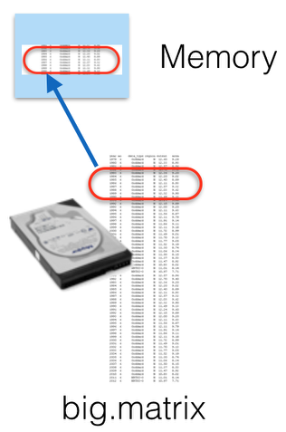
</div>

## Ideal gas Data Set

In `data/idealgas`, we have a set of synthetic data files describing an ideal gas experiment - setting temperature, amount of material, and volume, and measuring the pressure.  

Simple data sets:

```r
small.data <- read.csv("data/idealgas/ideal-gas-fixedT-small.csv")
small.data[1:2,]
```

```
##   X  pres        vol   n temp
## 1 1 99000 0.02036345 0.8  300
## 2 2 99250 0.02018306 0.8  300
```

Row name, pressure (Pa), volume (m^3^), N (moles), and temperature (K).

A larger data set consisting of 124M rows, 5.8GB, is sitting in ideal-gas-fixedT-large.csv, and we'd like to do some analysis of this data set.  But the size is a problem.

## A Note on File Formats

Let's consider the humble .csv file:
```
$ ls -sh1 airOT2010.*
151M airOT2010.RDS
151M airOT2010.Rdata
### <b>
1.4G airOT2010.csv
### </b>

$ Rscript  timeexamples.R
[1] "Reading Rdata file"
   user  system elapsed
 11.697   0.616  12.319
[1] "Reading RDS file"
   user  system elapsed
 11.041   0.644  11.694
### <b>
[1] "Reading CSV file"
   user  system elapsed
140.640   3.352 144.142
### </b>
```

## A Note on File Formats

CSV --- or really, any text-based format --- is the worst possible format for quantiative data. It manages 
the trifecta of being:

- Slow to read
- Huge
- Inaccurate

Converting floating point numbers back and forth between internal represenatations and strings is slow and
prone to truncation.  

Use binary formats whenver possible.  .Rdata is a bit prone to change; .RDS is modestly better.  Portable
file formats like HDF5 (for data frames) or NetCDF4 (for matrices and arrays) are compact, accurate, fast
(not as fast as .Rdata/.RDS), and can be read by tools other than R.


## Creating a file-backed big matrix

We've already created a big.matrix file from this data set, using

```r
data <- read.big.matrix("data/idealgas/ideal-gas-fixedT-large.csv", header=TRUE,  
                        backingfile="data/idealgas/ideal-gas-fixedT-large.bin", 
                        descriptorfile="ideal-gas-fixedT-large.desc")
```

This reads in the .csv file and outputs a binary equivalent (the "backingfile") and a descriptor (in the "descriptorfile") which contains all of the information which describes the binary blob.

You can read the descriptorfile: `more ideal-gas-fixedT-large.desc`

Done for you since initial convertion takes 12 minutes for this set - kind of boring.

**Note**: converts into a _matrix_, which is a less flexible data type than a data frame; homogeneous type.   Here, we'll use all numeric.

## Using a big.matrix

Let's do some simple analysis on the data set and see how memory behaves.

```r
library(bigmemory, quiet=TRUE)
```

```
## 
## bigmemory >= 4.0 is a major revision since 3.1.2; please see packages
## biganalytics and and bigtabulate and http://www.bigmemory.org for more information.
```

```r
orig.gc <- trunc.gc()
data <- attach.big.matrix("data/idealgas/ideal-gas-fixedT-large.desc")
trunc.gc()-orig.gc
```

```
##        used (Mb) max used (Mb)
## Ncells 1108  0.1        0    0
## Vcells 1599  0.0        0    0
```

## Using a big.matrix

Let's do some simple analysis on the data set and see how memory behaves.

```r
data[1:2,]
```

```
##           pres        vol   n temp
## [1,] 1 90000.0 0.01328657 0.5  280
## [2,] 2 90012.5 0.01285503 0.5  280
```

```r
system.time(min.p <- min(data[,"pres"]))
```

```
##    user  system elapsed 
##   0.617   1.169   5.597
```

```r
trunc.gc()-orig.gc
```

```
##        used (Mb) max used (Mb)
## Ncells 2820  0.2        0    0
## Vcells 3640  0.0        0    0
```

## Using a big.matrix

That only took ~7 seconds to scan through 124M records to find a minimum.  Let's try a few other calculations:
Let's do some simple analysis on the data set and see how memory behaves.

```r
min.p
```

```
## [1] 90000
```

```r
system.time(max.p <- max(data[,"pres"]))
```

```
##    user  system elapsed 
##   0.620   0.667   3.770
```

```r
system.time(mean.t <- mean(data[,"temp"]))
```

```
##    user  system elapsed 
##   1.376   1.361   7.205
```

## Using a big.matrix

Going through the same column a second time was faster, because some of the data was cached; going through a new column was about the same speed as the first.  What has that done to memory?

```r
trunc.gc()-orig.gc
```

```
##        used (Mb) max used (Mb)
## Ncells 2772  0.2        0    0
## Vcells 3456  0.0        0    0
```

## Using a big.matrix

Let's try something more complicated: we know that averaged over our data, we should have $p V = n R T$.  Let's try to infer the gas constant $R$:


```r
system.time(sum.pv <- sum(data[,"pres"]*data[,"vol"]))
```

```
##    user  system elapsed 
##   1.826   4.594  15.887
```

```r
system.time(sum.nt <- sum(data[,"n"]*data[,"temp"]))
```

```
##    user  system elapsed 
##   1.672   3.723  13.777
```

```r
sum.pv/sum.nt
```

```
## [1] 8.314471
```

## Using a big.matrix

And we're still not using that much memory.


```r
trunc.gc()-orig.gc
```

```
##        used (Mb)  max used  (Mb)
## Ncells 2790  0.2         0   0.0
## Vcells 3524  0.0 104175967 794.8
```

## Using a big.matrix

Let's extract a subset of the data and analyze it.  

The `mwhere` command in `bigmemory` lets us search through the data for **m**ultiple conditions, and extract that data:


```r
system.time(subset.data <- data[mwhich(data, cols=c("n","pres"), 
                                       vals=c(1.,101000.), comps="eq", op="AND"),])
```

```
##    user  system elapsed 
##   1.581   0.195   3.288
```

```r
class(subset.data)
```

```
## [1] "matrix"
```

```r
fit <- lm(vol ~ temp, data=as.data.frame(subset.data))
```

## Using a big.matrix


```r
summary(fit)
```

```
## 
## Call:
## lm(formula = vol ~ temp, data = as.data.frame(subset.data))
## 
## Residuals:
##        Min         1Q     Median         3Q        Max 
## -1.243e-03 -3.155e-04 -3.487e-05  2.993e-04  1.289e-03 
## 
## Coefficients:
##               Estimate Std. Error t value Pr(>|t|)    
## (Intercept) -6.688e-04  4.711e-04   -1.42    0.156    
## temp         8.459e-05  1.569e-06   53.90   <2e-16 ***
## ---
## Signif. codes:  0 '***' 0.001 '**' 0.01 '*' 0.05 '.' 0.1 ' ' 1
## 
## Residual standard error: 0.0004595 on 639 degrees of freedom
## Multiple R-squared:  0.8197,	Adjusted R-squared:  0.8194 
## F-statistic:  2905 on 1 and 639 DF,  p-value: < 2.2e-16
```

## Using a big.matrix


```r
object.size(subset.data)
```

```
## 26336 bytes
```

```r
trunc.gc()-orig.gc
```

```
##         used (Mb)  max used  (Mb)
## Ncells 19393  1.0     20961   1.1
## Vcells 41409  0.3 104175967 794.8
```

## Using a big.matrix

Other options:

- `morder` or `mpermute` allow you to sort the data in memory or on disk
- `head` and `tail` let you get the start/end rows
- `mwhich` allows all sorts of slicing and dicing
- `sub.big.matrix` lets you extract contiguous regions of the matrix

## Summary: bigmemory

If you just have a data file much larger than memory that you have to crunch and the amount of actual computation is not a bottleneck, the `bigmemory` and related packages may be all you need.

Works best if:

- Data is of homogeneous type - eg, all integer, all numeric, all string
- Just need to work on a subset of data at a time, or
- Just need to make one or two passes through the data to complete analysis

## Bigmemory hands-on

`lm()` doesn't work natively on a `big.matrix` - but we can write our own.

If we have an OLS model $\hat{y_i} = a x_i + b + \epsilon$, we can fit it with 

$b = \bar{y} - a \bar{x}$

$a = \frac{\sum_i{ x_i y_i } - n \bar{x} \bar{y}}{\sum_i{x_i^2} - n \bar{x} \bar{x}}$

Using the examples above, fit a couple of columns of the ideal gas data set.  Do the results make
sense?  (Once it's working, try fitting $pV \propto nT$.)  How much memory is used?

# Using multiple processors in R

## Using multiple processors in R

The rest of today will cover using more processors and/or nodes to do large-scale computations 
in R.

Outline:

- No-work parallelism: existing packages
- `parallel` package:
    - multicore (use all cores on a computer): non-windows
    - snow (use all cores on a computer, or across a cluster)
- `foreach` package: different interface to similar functionality
- `Rdsm`: shared-memory parallelism (on-node) with big.matrix
- `pbdR`: massive scale computation with MPI+R

## Existing parallelism

It's important to realize that many fundamental routines as well as higher-level packages come with some degree of scalability and parallelism "baked in".  

Open another terminal to your node, and run `top` while executing the following in R:


```r
n <- 4*1024
A <- matrix( rnorm(n*n), ncol=n, nrow=n )
B <- matrix( rnorm(n*n), ncol=n, nrow=n )
C <- A %*% B
```

## Existing parallelism

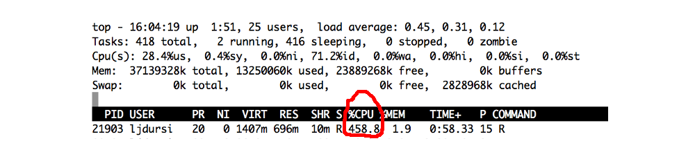

One R process using 458% of a processor.

R can be built using high performance threaded libraries for math in general, and linear algebra
--- which underlies *many* data analysis algorithms --- in particular.

Here the single R process has launched several threads of execution -- all of which are part of the same process, and so can see the same memory, eg the large matrices.

## Processes vs Threads vs CPUs vs Cores

<div class="columns-2">

A process is a running program. It has data, the program code, and one or more threads of execution - points in the code that is currently being run.  

A thread can see all of the data (and all other threads) within a process; you can't see anything
outside of your own user process.

The operating system assigns running threads to cores (or CPUs, or processors, which are the same
thing and I'll use the terms interchangably.)  

"Core" is the least ambiguous term --- an independent processing unit.

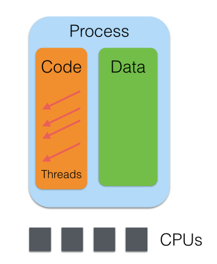
</div>

## Split, Apply, Combine

Popularized by Henry Wickham for R (in the paper describing his `pylr` pacakge), this has
become a model for thinking about data analysis in R (and to some extent, pandas.)

Split the data set up into relevant sub-sets; apply some analysis to it; combine the
results.

*E.g.*, seasonal detrending - break data up by months before applying.  Break public
health data up into relevant demographic groups, and apply analyses.  Etc.

This is exactly the way to think about scalable data analysis.  Split the data - 
or tasks on that data - up between computing elements; do the analyses; then combine
the results somehow.

The details depend a great deal on the analyses (and the nature of the data.)

## Packages that explicitly use parallelism

For a complete list, see 

http://cran.r-project.org/web/views/HighPerformanceComputing.html .

- Biopara
- BiocParallel for Bioconductor
- bigrf - Random Forests
- caret - cross-validation, bootstrap characterization of predictive models
- GAMBoost - boosting glms

Plus packages that use linear algebra or other expensive math operations which 
can be implicitly multithreaded.

When at all possible, don't do the hard work yourself --- look to see if a package already
exists which will do your analysis at scale.

# Using all Processors on a Computer with parallel/multicore

## The Parallel Package

Since R 2.14.0 (late 2011), the `parallel` package has been part of core R. 

Incorporates - and mostly supersedes - two other packages:

- `multicore`: for using all processors on a single processor.  Not on windows.
- `snow`: for using any group of processors, possibly across a cluster.

Many packages which use parallelism use one of these two, so worth understanding.

Both create new *processes* (not threads) to run on different processors; but in importantly
different ways.

## Multicore - forking
    
<div class="columns-2">

Multicore creates new processes by forking --- cloning -- the original process.  

That means the new processes starts off seeing a copy of exactly the same data as the original.
*E.g.*, first process can read a file, and then fork two new processes - each will see copy of the
file.

*Not* shared memory; changes in one process will not be reflected in others.

Windows doesn't have fork(), so windows can't use these routines.

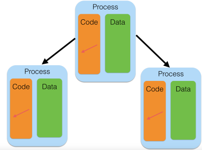
</div>

## Multicore - forking
    
<div class="columns-2">
**Performance Tip**: Modern OSs are lazy - the copy of memory isn't made unless it has to be, and
it doesn't have to be until one process or the other writes to the memory.  

That copy is slow, and takes new memory.  

So in `multicore`, don't overwrite old variables if possible.


</div>

## Snow - Spawning
    
<div class="columns-2">
Snow creates entirely new R processes to run the jobs.

A downside is that you need to explicitly copy over any needed data, functions.

But the upsides are that spawning a new process can be done on a remote machine, 
not just current machine.  So you can in principle use entire clusters.

In addition, the flipside of the downside: new processes don't have any unneeded data 
- less total memory footprint.

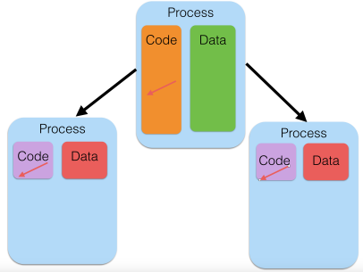
</div>

## mcparallel/mccollect

The simplest use of the `multicore` package is the pair of functions `mcparallel()` and 
`mccollect()`.

`mcparallel()` forks a task to run a given function; it then runs in the background.  
`mccollect()` waits for and gets the result.

Let's pick an example: reading the airlines data set, we want --- for a particular month --- to 
know both the total number of planes in the data (by tail number) and the median elapsed flight
time.  These are two independant calculations, and so can be done independantly.

## mcparallel/mccollect

We start the two tasks with `mcparallel`, and collect the answers with` mccollect`:

```r
library(parallel, quiet=TRUE)
source("data/airline/read_airline.R")
jan2010 <- read.airline("data/airline/airOT201001.csv")
unique.planes <- mcparallel( length( unique( sort(jan2010$TAIL_NUM) ) ) ) 
median.elapsed <- mcparallel( median( jan2010$ACTUAL_ELAPSED_TIME, na.rm=TRUE ) )
ans <- mccollect( list(unique.planes, median.elapsed) )
ans
```

```
## $`60035`
## [1] 4555
## 
## $`60036`
## [1] 110
```
We get a list of answers, with each element "named" by the process ID that ran the job.  We find that there are 4555 planes in the data set, and the median flight in the data set is 110 minutes 
in the air.

## mcparallel/mccollect

Does this save any time?  Let's do some independent fits to the data.  Let's try to see what
the average in-flight speed is by fitting time in the air to distance flown; and let's see how the 
arrival delay correlates with the departure delay.  (Do planes, on average, make up some time
in the air, or do delays compound?)


```r
system.time(fit1 <-  lm(DISTANCE ~ AIR_TIME, data=jan2010))
```

```
##    user  system elapsed 
##   0.805   0.053   0.860
```

```r
system.time(fit2 <-  lm(ARR_DELAY ~ DEP_DELAY, data=jan2010))
```

```
##    user  system elapsed 
##   0.379   0.033   0.413
```

## mcparallel/mccollect

So the time to beat is about 1.2s:

```r
parfits <- function() {
  pfit1 <- mcparallel(lm(DISTANCE ~ AIR_TIME, data=jan2010))
  pfit2 <- mcparallel(lm(ARR_DELAY ~ DEP_DELAY, data=jan2010))
  mccollect( list(pfit1, pfit2) )
}
system.time( parfits() )
```

```
##    user  system elapsed 
##   3.484   0.282   1.317
```
We do see a savings of time --- ~1.0s vs 1.2s (and the best we could have done is ~0.8s.  Why?).
But clearly actually forking the processes and waiting for them to rejoin itself takes some time.  

This overhead means that we want to launch jobs that take a significant length of
time to run - much longer than the overhead (hundredths to tenths of seconds for fork().)

## Clustering

Typically we want to do more than an itemized list of independent tasks - we have a list
of similar tasks we want to perform.

`mclapply` is the multicore equivalent of `lapply` - apply a function to a list, get 
a list back.

Let's say we want to see what similarities there are between delays at O'Hare airport 
in Chicago in 2010.  Clustering methods attempt to uncover "similar" rows in a dataset
by finding points that are near each other in some $p$-dimensional space, where $p$ is the
number of columns.

$k$-Means is a particularly simple, randomized, method; it picks $k$ cluster centre-points
at random, finds the rows closest to them, assigns them to the cluster, then moves the
cluster centres towards the centre of mass of their cluster, and repeats.

Quality of result depends on number of random trials.

## Clustering

Let's try that with our subset of data:


```r
# columns listing various delay measures
delaycols <- c(18, 28, 40, 41, 42, 43, 44)
air2010 <- readRDS("data/airline/airOT2010.RDS")
ord.delays <- air2010[(air2010$ORIGIN=="ORD"), delaycols]
rm(air2010)
ord.delays <- ord.delays[(ord.delays$ARR_DELAY_NEW > 0),]
ord.delays <- ord.delays[complete.cases(ord.delays),]

system.time( serial.res   <- kmeans(ord.delays, centers=2, nstart=40) )
```

```
##    user  system elapsed 
##   3.497   0.166   3.671
```

```r
serial.res$betweenss
```

```
## [1] 349691373
```

## Clustering with lapply

Running 40 random trials is the same as running 10 random trials 4 times.  Let's try that approach with `lapply`:


```r
do.n.kmeans <- function(n) { kmeans(ord.delays, centers=2, nstart=n) }
system.time( list.res <- lapply( rep(10,4), do.n.kmeans ) )
```

```
##    user  system elapsed 
##   8.275   0.228   8.590
```

```r
res <- sapply( list.res, function(x) x$tot.withinss )
lapply.res <- list.res[[which.min(res)]]
lapply.res$withinss
```

```
## [1] 125489706 254304505
```
Get the same answer, but a little longer - bit of overhead from splitting it up and starting the
process four times.  We could make the overhead less important by using more trials, which would be 
better anyway.

## Clustering with mclapply

`mclapply` works the same way as lapply, but forking off the processes (as with
`mcparallel`)


```r
system.time( list.res <- mclapply( rep(10,4), do.n.kmeans, mc.cores=4 ) )
```

```
##    user  system elapsed 
##   7.736   0.625   2.673
```

```r
res <- sapply( list.res, function(x) x$tot.withinss )
mclapply.res <- list.res[[which.min(res)]]
mclapply.res$tot.withinss
```

```
## [1] 379794211
```

## Clustering with mclapply

Note what the output of top looks like when this is running:

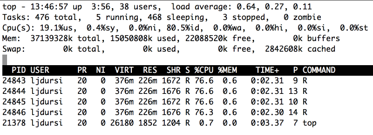

There are four separate processes running - not one process using multiple CPUs via threads.

## Clustering with mclapply

Looks good!  Let's take a look at the list of results:

```r
res
```

```
## [1] 379794211 379794211 379794211 379794211
```
What happened here?

## Parallel RNG 

Depending on what you are doing, it may be very important to have different (or the same!)
random numbers generated in each process.

Here, we definitely want them different - the whole point is to generate different
random realizations.

`parallel` has a good RNG suitable for parallel work based on the work of Pierre L'Ecuyer 
in Montr&eacute;al:

```r
RNGkind("L'Ecuyer-CMRG")
mclapply( rep(1,4), rnorm, mc.cores=4, mc.set.seed=TRUE)
```

```
## [[1]]
## [1] -0.2663316
## 
## [[2]]
## [1] 0.05669145
## 
## [[3]]
## [1] -0.8542507
## 
## [[4]]
## [1] -1.585133
```

## Load balancing

Let's say that, instead of running multiple random trials to find the best given a set of clusters,
we were unsure of how many clusters we wanted to run:

```r
do.kmeans.nclusters <- function(n) { kmeans(ord.delays, centers=n, nstart=10) }
time.it <- function(n) { system.time( res <- do.kmeans.nclusters(n)) }
lapply(1:4, time.it)
```

```
## [[1]]
##    user  system elapsed 
##   1.557   0.037   1.594 
## 
## [[2]]
##    user  system elapsed 
##   1.979   0.052   2.040 
## 
## [[3]]
##    user  system elapsed 
##   2.678   0.044   2.730 
## 
## [[4]]
##    user  system elapsed 
##   3.948   0.049   4.003
```

## Load balancing

More clusters takes longer.  If we were to `mclapply` these four tasks on 2 CPUs, the first
CPU would get the two short tasks, and the second CPU would get the second, longer tasks - 
bad _load_ _balance_.  

Normally, we want to hand multiple tasks of work off to each processor and only hear back when
they're completely done - minimal overhead.  But that works best when all tasks have similar 
lengths of time.

If you don't know that this is true, you can do _dynamic_ scheduling - give each processor one
task, and when they're done they can ask for another task.

More overhead, but better distribution of work.

## Load balancing


```r
system.time( res <- mclapply(1:4, time.it, mc.cores=2) )
```

```
##    user  system elapsed 
##   4.746   0.257   6.502
```

```r
system.time( res <- mclapply(1:4, time.it, mc.cores=2, mc.preschedule=FALSE) )
```

```
##    user  system elapsed 
##  13.114   0.809   6.213
```


## Splitting the data set

So far we've seen splitting the tasks; let's consider splitting the dataset.

Let's make a histogram of the times flights took off - say, binned by the hour.


```r
get.hour <- function(timeInt) timeInt %/% 100
count.hours <- function(range) {
  counts <- rep(0,24)
  hours <- sapply(jan2010$DEP_TIME[range], get.hour)
  hist <- rle( sort(hours) )
  for (i in 1:length(hist$values)) {
    j <- hist$values[i] + 1
    if (j == 25) j = 1
    counts[j] <- hist$lengths[i]
  }
  counts
}
```


## Splitting the data set

We can count up *all* flight hours like so:

```r
system.time(scounts <- count.hours(1:nrow(jan2010)))
```

```
##    user  system elapsed 
##   1.959   0.040   2.011
```

```r
scounts
```

```
##  [1]    23   383   127    40   205 12321 30203 31435 34210 32344 31989
## [12] 34075 31938 33802 32555 31020 33869 33731 30760 29542 19592 14260
## [23]  7470  2574
```

## Splitting the data set

Can we split this up between tasks?  Let's try this:

```r
nr <- nrow(jan2010)
ncores <- 4
chunks <- split(1:nr, rep(1:ncores, each=nr/ncores))
```

```
## Warning in split.default(1:nr, rep(1:ncores, each = nr/ncores)): data
## length is not a multiple of split variable
```

```r
system.time(counts <- mclapply( chunks, count.hours, mc.cores=ncores) )
```

```
##    user  system elapsed 
##   3.753   0.183   0.398
```

## Splitting the data set

That was definitely faster - how do the answers look?


```r
str(counts)
```

```
## List of 4
##  $ 1: num [1:24] 8 204 75 32 54 ...
##  $ 2: num [1:24] 9 121 49 4 78 ...
##  $ 3: num [1:24] 4 49 2 2 64 ...
##  $ 4: num [1:24] 2 9 1 2 9 ...
```

```r
Reduce("+", counts)
```

```
##  [1]    23   383   127    40   205 12321 30203 31435 34210 32344 31989
## [12] 34075 31938 33802 32555 31020 33869 33731 30760 29542 19592 14260
## [23]  7470  2574
```

To be fair, we'd have to include the Reduction time in the total time - but that's just the sum of 
four short vectors, probably not a big deal.

## pvec - simplified mclapply

For the simple and common case of applying a function to each element of a vector and returning a
vector, the parallel package has a simplified version of mclapply called `pvec`.

```r
fx <- function(x) x^5-x^3+x^2-1
maxn <- 1e6
system.time( res <- sapply(1:maxn, fx) )
```

```
##    user  system elapsed 
##   4.663   0.055   4.725
```

```r
system.time( res <- vapply(1:maxn, fx, 0.) )
```

```
##    user  system elapsed 
##   1.449   0.061   1.511
```

## pvec - simplified mclapply


```r
system.time( res <- pvec(1:maxn, fx, mc.cores=2) )
```

```
##    user  system elapsed 
##   1.108   0.444   0.113
```

```r
system.time( res <- pvec(1:maxn, fx, mc.cores=4) )
```

```
##    user  system elapsed 
##   0.137   0.061   0.095
```

```r
system.time( res <- mclapply(1:maxn, fx, mc.cores=4) )
```

```
##    user  system elapsed 
##   0.922   0.298   1.077
```

## parallel/multicore hands-on

Using the entire 2010 dataset, and the examples above, examine one of the following questions:

- In 2010, what airport (with more than say 10 outgoing flights) had the largest fraction of 
outgoing flights delayed?
- For some given airport - what hour of the day had the highest relative fraction of delayed flights?
- For all airports?
- What is the effect of including the `split()` and the `Reduce()` on the serial-vs-parallel timings for this histogram?  Is there a better way of doing the splitting?

## Summary: parallel/multicore 

The `mc*` routines in parallel work particularly well when:

- You want to make full use of the processors on a single computer
- Each task only reads from some big common data structure and produces modest-sized results
- `mcparallel` works very well for task parallelism; the `mclapply` for data parallelism.

Things to watch for:

- Modifying the big common data structure:
    - Won't be seen by other processes,
    - But will blow up the memory requirements
- You can only use one machine's processors
- Won't work on Windows (but what does?)
- `mc.cores` is a lie.  It's the number of  _tasks_, not _cores_.  On an 8-core machine, if you have multithreaded libraries for (say linear algebra) and launch something `mc.cores=8` that does heavy linear algebra, you'll end up with 64 threads competing for 8 cores.  Either make sure to turn off threading (`export OMP_NUM_THREADS=1`), or use fewer tasks.

# Multiple computers with parallel/snow


## Multiple computers with parallel/snow

The other half of parallel, routines that were in the still-active `snow` package, allow you
to again launch new R processes --- by default, on the current computer, but also on any computer
you have access to.   (SNOW stands for "Simple Network of Workstations", which was the original 
use case).

The recipe for doing computations with snow looks something like:


```r
library(parallel)
cl <- makeCluster(nworkers,...)
results1 <- clusterApply(cl, ...)
results2 <- clusterApply(cl, ...)
stopCluster(cl)
```

other than the `makeCluster()`/`stopCluster()`, it looks very much like multicore and `mclapply`.

## Hello world

Let's try starting up a "cluster" (eg, a set of workers) and generating some random numbers 
from each:


```r
library(parallel)
cl <- makeCluster(4)
clusterCall(cl, rnorm, 5)
```

```
## [[1]]
## [1] -1.67980521  0.07231453 -2.86222510 -1.14412811 -1.07507705
## 
## [[2]]
## [1]  1.7225937 -2.1514615  0.7479726  0.3462565  0.4007136
## 
## [[3]]
## [1]  2.1567110  1.4165691  0.6163711 -0.5946785 -0.1505198
## 
## [[4]]
## [1] -1.5087876 -0.5692297 -0.4687581 -0.5582737 -1.4143717
```

```r
stopCluster(cl)
```

## Hello world

`clusterCall()` runs the same function (here, `rnorm`, with argument `5`) on all workers in
the cluster.  A related helper function is `clusterEvalQ()` which is handier to use for some
setup tasks - eg, 

```r
clusterEvalQ(cl, {library(parallel); library(foreach); NULL} )
```

## Clustering on Clusters

Emboldened by our success so far, let's try re-doing our $k$-means calculations:


```r
delaycols <- c(18, 28, 40, 41, 42, 43, 44)

source("data/airline/read_airline.R")
jan2010 <- read.airline("data/airline/airOT201001.csv")
jan2010 <- jan2010[,delaycols]
jan2010 <- jan2010[complete.cases(jan2010),]
do.n.kmeans <- function(n) { kmeans(jan2010, centers=4, nstart=n) }
```

```r
library(parallel)
cl <- makeCluster(4)
res <- clusterApply(cl, rep(5,4), do.n.kmeans)
stopCluster(cl)
```

```r
##  Error in checkForRemoteErrors(val) : 
##    4 nodes produced errors; first error: object 'jan2010' not found
```
Ah!  Failure.

## Clustering on Clusters

Recall that we aren't forking here; we are creating processes from scratch.  These processes,
new to this world, are not familiar with our ways, customs, or datasets.  We actually have to 
ship the data out to the workers:


```r
cl <- makeCluster(4)
system.time(clusterExport(cl, "jan2010"))
```

```
##    user  system elapsed 
##   0.140   0.034   0.531
```

```r
system.time(cares <- clusterApply(cl, rep(5,4), do.n.kmeans))
```

```
##    user  system elapsed 
##   0.410   0.039  17.325
```

```r
stopCluster(cl)
system.time( mcres <- mclapply(rep(5,4), do.n.kmeans, mc.cores=4) )
```

```
##    user  system elapsed 
##  46.919   2.061  16.895
```

## Clustering on Clusters

Note that the costs of shipping out data back and forth, and creating the processes from
scratch, is relatively costly - but this is the price we pay for being able to spawn the processes
anywhere.  

(And if our computations take hours to run, we don't really care about several-second delays.)

## Running across machines

The default cluster is a sockets-based cluster; you can run on multiple machines by 
specifying them to a different call to makeCluster:


```r
hosts <- c( rep("localhost",8), rep("gpc01", 2) )
cl <- makePSOCKcluster(names=hosts)
clusterCall(cl, rnorm, 5)
clusterCall(cl, system, "hostname")
stopCluster(cl)
```

For this to work, you will almost certainly have to (temporarily) tack the line
```
source ${SCRATCH}/ScalableDataAnalysis/R/setup
```
to the bottom of your `.bashrc`.  But once it is done, you have succcessfully run random number
generators across multiple hosts.

## Cluster types

`parallel` has several different cluster types:

- PSOCK (Posix sockets): the default type
- Fork workers: but if you're going to use this, you may as well just use multicore.
- MPI: this is similar in a way to PSOCK clusters, but startup and communications can be much faster once you start going to large numbers (say >64) of hosts.  We won't cover this today; using the MPI cluster type is conceptually identical to PSOCK clusters.

## Work distribution and Load Balancing

Because of the need to send (possibly large) data to the workers, the scheduling of
workers is even more important than with multicore.

The `snow` library has very nice visualization tools for timing that are inexplicably absent
from `parallel`; so let's temporarily use snow:


```r
library(snow,quiet=TRUE)
```

```
## 
## Attaching package: 'snow'
## 
## The following objects are masked from 'package:parallel':
## 
##     clusterApply, clusterApplyLB, clusterCall, clusterEvalQ,
##     clusterExport, clusterMap, clusterSplit, makeCluster,
##     parApply, parCapply, parLapply, parRapply, parSapply,
##     splitIndices, stopCluster
```

## Work distribution and Load Balancing


```r
do.kmeans.nclusters <- function(n) { kmeans(jan2010, centers=n, nstart=10) }

cl <- makeCluster(2)
clusterExport(cl,"jan2010")
tm <- snow.time( clusterApply(cl, 1:6, do.kmeans.nclusters) )
```

## Work distribution and Load Balancing


```r
plot(tm)
```

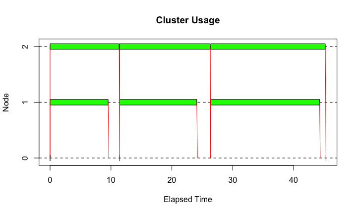 

## Work distribution and Load Balancing


```r
tm.lb <- snow.time(clusterApplyLB(cl, 1:6, do.kmeans.nclusters))
plot(tm.lb)
```

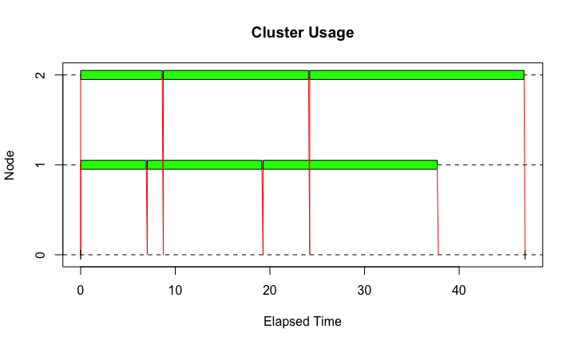 

```r
stopCluster(cl)
```

## Work distribution and Load Balancing

The default `clusterApply` sends off one task to each worker, waits until they're both done, then
sends off another.  (Question: why?)

`clusterApplyLB` does something more like `mc.preschedule=FALSE`; it fires off tasks to each worker
as needed.  

Sending off one task at a time can be inefficient if there is a lot of commnication involved. But it allows
flexibility in scheduling, which is vitally important if the tasks are of widely varying durations.

## clusterSplit and Hour Histogram

Of course, for some applications, we don't need to send the entire data structure across.  Let's consider
the departure-time histogram again.  This time, we're only going to send across the data that's going t
be computed:


```r
jan2010 <- read.airline("data/airline/airOT201001.csv")
jan2010 <- jan2010[complete.cases(jan2010),]

get.hour <- function(timeInt) timeInt %/% 100
count.hours <- function(timesInt) {
  counts <- rep(0,24)
  hours <- sapply(timesInt, get.hour)
  hist <- rle( sort(hours) )
  for (i in 1:length(hist$values)) {
    j <- hist$values[i] + 1
    if (j == 25) j = 1
    counts[j] <- hist$lengths[i]
  }
  counts
}
```

## clusterSplit and Hour Histogram 

This time, rather than exporting the entire data set, we'll just send across the bits we need:

```r
cl <- makeCluster(2)
clusterExport(cl,"get.hour")  # have to export _functions_, too.
datapieces <- clusterSplit(cl,jan2010$DEP_TIME)
str(datapieces)
```

```
## List of 2
##  $ : int [1:253778] 1425 1228 1053 1047 1753 1755 1846 1859 1752 1757 ...
##  $ : int [1:253779] 1450 1459 1458 1455 723 704 659 658 701 702 ...
```

```r
ans <- clusterApply(cl, datapieces, count.hours)
Reduce("+", ans)
```

```
##  [1]    23   381   126    40   205 12279 30069 31268 34042 32198 31881
## [12] 33936 31843 33686 32437 30907 33750 33644 30686 29455 19522 14184
## [23]  7434  2556
```

## clusterSplit and Hour Histogram

To look a little more closely at some communciations and load balance issues, I'm going to 
split the data up into more pieces than workers, and distribute them:

```r
stopCluster(cl)
cl <- makeCluster(6)
datapieces <- clusterSplit(cl,jan2010$DEP_TIME)
stopCluster(cl)

cl <- makeCluster(2)
clusterExport(cl,"get.hour")  # have to export _functions_, too.
str(datapieces)
```

```
## List of 6
##  $ : int [1:84255] 1425 1228 1053 1047 1753 1755 1846 1859 1752 1757 ...
##  $ : int [1:84762] 1337 2045 658 1423 1645 1923 853 1613 2048 755 ...
##  $ : int [1:84761] 2048 2037 2031 2039 2034 2035 2036 1634 1840 1639 ...
##  $ : int [1:84762] 1450 1459 1458 1455 723 704 659 658 701 702 ...
##  $ : int [1:84762] 723 723 825 919 912 726 722 723 725 727 ...
##  $ : int [1:84255] 1705 1036 1242 942 1653 2135 1330 734 1831 1253 ...
```

## clusterSplit and Hour Histogram


```r
tm <- snow.time( ans <- clusterApply(cl, datapieces, count.hours) )
plot(tm)
```

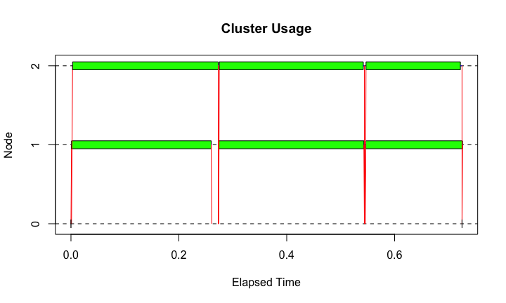 

## clusterSplit and Hour Histogram

```r
tm <- snow.time( ans <- parLapply(cl, datapieces, count.hours) )
plot(tm)
```

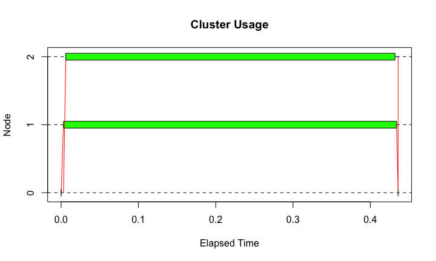 

```r
stopCluster(cl)
```

## clusterSplit and Hour Histogram

If the list you are operating on consists of big chunks of data, the relevant piece is sent to the
worker for its task.

Sometimes that's exactly what you want:

- The chunks nearly fill up memory
- You don't know which task will do which chunk (`clusterApplyLB`)

But if it's not necessary, it adds a delay to the task.  If you know ahead of time the tasks are
of similar duration:

- clusterExport the whole data set (if everyone needs the whole data set)
- Use clusterSplit to split the data set into exactly what each worker needs
- or use `parLapply` to chunk up the data for you and send all the data for one task all at once.

## Back to parallel

```r
detach("package:snow", unload=TRUE)
```

## Summary: parallel/snow

The `cluster` routines in `parallel` are good if you know you will eventually have to move to using
multiple computers (nodes in a cluster, or desktops in a lab) for a single computation. 

- Use `clusterExport` for functions and data that will be needed by everyone.
- Communicating data is slow, but *much* faster than having every worker read the same data from a file.
- Use `clusterApplyLB` if the tasks vary greatly in runtime.
- Use `clusterApply` if each task requires an enormous amount of data.
- Use `parLapply` if tasks are similar duration and data from multiple tasks will fit in memory.
- `snow::snow.time` is great for understanding performance.
- Use `makePSOCKcluster` for small clusters; consider `makeMPIcluster` for larger (but see `pbdR` section this afternoon).

## Hands-On: parallel/snow

Working with a partner, qsub a session with two nodes, and setup a PSOCK cluster across both nodes.
(you can `cat $PBS_NODEFILE` once your job has started to see the other node.)  Call `unlist(clusterCall(cl, system, "hostname"))` to make sure that you have workers on both nodes.

Load the 2010 data and break it up by month (look up the `split` command) and see which month had the highest
fraction of cancelled flights.  

Then split the data up by airline and see which airline had the highest fraction of cancelled flights.

There are two big downsides with how we are doing this: the master is doing a huge amount of the work by
doing the pre-splitting, and the whole data set has to be in memory.   Tackle one or the other of them:

- Master doing too much work: Just partition the data into chunks, and let each worker do the
splitting up and counting itself.  For the combined results to be meaningful, the worker will
need to know the full set of airlines (or the full set of months, which is somewhat easier.)  
How to do that?
- Master having whole problem in memory: use bigmemory along with parallel.

# foreach and doparallel

## foreach and doparallel

The "master/worker" approach that `parallel` enables works extremely well for moderately sized problems,
and isn't that difficult to use.  It is all based on one form of R iteration, apply, which is well understood.  

However, going from serial to parallel requires some re-writing, and even going from one method of
parallelism to another (eg, `multicore`-style to `snow`-style) requires some modification of code.

The `foreach` package is based on another style of iterating through data - a for loop - and is designed
so that one can go from serial to several forms of parallel relatively easily.  There are then a number of tools one can use in the library to improve performance.

## foreach - serial

The standard R for loop looks like this:

```r
for (i in 1:3) print(sqrt(i))
```

```
## [1] 1
## [1] 1.414214
## [1] 1.732051
```

The foreach operator looks similar, but returns a list of the iterations:

```r
library(foreach)
foreach (i=1:3) %do% sqrt(i)
```

```
## [[1]]
## [1] 1
## 
## [[2]]
## [1] 1.414214
## 
## [[3]]
## [1] 1.732051
```

## foreach - serial


```r
library(foreach)
foreach (i=1:3) %do% sqrt(i)
```
The foreach function creates an object, and the `%do%` operator operates on the code (here just one statement,
but it can be multiple lines between braces, as with a for loop) and the foreach object.

## foreach + doParallel

Foreach works with a variety of backends to distribute computation - `doParallel`, which allows snow- and
multicore-style parallelism, and `doMPI` (not covered here).   

Switching the above loop to paralleljust requires registering a backend and using `%dopar%` rather than `%do%`:

```r
library(doParallel)
```

```
## Loading required package: iterators
```

```r
registerDoParallel(3)  # use multicore-style forking
foreach (i=1:3) %dopar% sqrt(i)
```

```
## [[1]]
## [1] 1
## 
## [[2]]
## [1] 1.414214
## 
## [[3]]
## [1] 1.732051
```

```r
stopImplicitCluster()
```

## foreach + doParallel

One can also use a PSOCK cluster:

```r
cl <- makePSOCKcluster(3)
registerDoParallel(cl)  # use the just-made PSOCK cluster
foreach (i=1:3) %dopar% sqrt(i)
```

```
## [[1]]
## [1] 1
## 
## [[2]]
## [1] 1.414214
## 
## [[3]]
## [1] 1.732051
```

```r
stopCluster(cl)
```

## Combining results

While returning a list is the default, `foreach` has a number of ways to combine the individual results:

```r
foreach (i=1:3, .combine=c) %do% sqrt(i)
```

```
## [1] 1.000000 1.414214 1.732051
```

```r
foreach (i=1:3, .combine=cbind) %do% sqrt(i)
```

```
##      result.1 result.2 result.3
## [1,]        1 1.414214 1.732051
```

```r
foreach (i=1:3, .combine="+") %do% sqrt(i)
```

```
## [1] 4.146264
```

```r
foreach (i=1:3, .multicombine=TRUE, .combine="sum") %do% sqrt(i)
```

```
## [1] 4.146264
```

## Combining results

Most of these are self explanatory.  `multicombine` is worth mentioning: by default, `foreach` will combine
each new item individually.  If `.multicombine=TRUE`, then you are saying that you're passing a function
which will do the right thing even if foreach gives it a whole wack of new results as a list or vector -
*e.g.*, a whole chunk at a time.

## Composing foreach Objects

There's one more operator: `%:%`.  This lets you compose or nest foreach objects:

```r
foreach (i=1:3, .combine="c") %:% 
  foreach (j=1:3, .combine="c") %do% {
    i*j
  }
```

```
## [1] 1 2 3 2 4 6 3 6 9
```

## Filtering Items

And you can also filter items, using `with`:

```r
foreach (a=rnorm(25), .combine="c") %:%
  when(a >= 0) %do%
    sqrt(a)
```

```
##  [1] 0.5711650 1.1747720 1.0368647 0.7757276 1.1703830 0.5745369 0.2390182
##  [8] 0.3328354 0.5997080 1.1569824
```

## Histogram

Let's consider our hour histogram again:

```r
system.time(
  foreach (i=1:2000, .combine="+") %do% {
    hrs <- rep(0,24)
    hr <- get.hour(jan2010$DEP_TIME[i])
    hrs[hr+1] = hrs[hr+1] + 1
    hrs
  }
)
```

```
##    user  system elapsed 
##   1.046   0.007   1.055
```
Note: like a function, we have to make sure the function we want to return is the last line (or explicitly
returned).

## Parallel Histogram

What's more, this automatically works in parallel:

```r
cl <- makePSOCKcluster(3)
registerDoParallel(cl,cores=3)
system.time(
  foreach (i=1:2000, .combine="+") %dopar% {
    hrs <- rep(0,24)
    hr <- get.hour(jan2010$DEP_TIME[i])
    hrs[hr+1] = hrs[hr+1] + 1
    hrs
  }
)
```

```
##    user  system elapsed 
##   1.865   0.286   3.698
```

```r
stopCluster(cl)
```
Which is actually sort of magic; PSOCK clusters don't share memory!  `foreach` does a good job of
exporting necessary variables; if something isn't automatically exported, it can be exported explicitly
in the foreach line with, eg, `foreach(..., .export=c("jan2010"))`.

## Histogram Performance

But this is incredibly slow:

```r
system.time(
  ans <- foreach (i=1:2000, .combine="+") %do% {
    hrs <- rep(0,24)
    hr <- get.hour(jan2010$DEP_TIME[i])
    hrs[hr+1] = hrs[hr+1] + 1
    hrs
  }
)
```

```
##    user  system elapsed 
##   1.023   0.006   1.029
```

```r
system.time(ans <- count.hours(jan2010$DEP_TIME[1:2000]))
```

```
##    user  system elapsed 
##   0.003   0.000   0.003
```
Mainly because it's not vectorized; by looping over the data one item at a time we've avoided using our
lovely fast vector routines.  Plus allocating a 24-hour-long vector per item!

## Histogram Performance

Another problem - we've created a vector `1:2000` which in general is the same size as the data set
we're working on.  For large data sets, big memory.

Foreach has _iterators_ that can iterate through an object without creating something the size of the
object.  For instance, `icount()` is like the difference between Python 2.x range and xrange:

```r
system.time(
  ans <- foreach (i=icount(2000), .combine="+") %do% {
    hrs <- rep(0,24)
    hr <- get.hour(jan2010$DEP_TIME[i])
    hrs[hr+1] = hrs[hr+1] + 1
    hrs
  }
)
```
But that doens't help with the performance issue here.

## Histogram Performance

We do a little bit better by avoiding the intermediate index; we don't care about $i$ at all, all
we care about is the data.  We can implicitly create an iterator on the object with

```r
 foreach (time=jan2010$DEP_TIME[1:2000],...
```
 
or explicitly, setting the chunk size to distribute between tasks:

```r
system.time(
  ans <- foreach (time=iter(jan2010$DEP_TIME[1:2000],chunksize=500), .combine="+") %do% {
    hrs <- rep(0,24)
    hr <- get.hour(time)
    hrs[hr+1] = hrs[hr+1] + 1
    hrs
  }
)
```

```
##    user  system elapsed 
##   1.005   0.004   1.010
```

```r
ans
```

```
##  [1]   0   0   0   0   0  86  53 166 154 107 117 102 221 138 109  96 137
## [18] 142 141  59  95  66   7   4
```

## Histogram Performance

As you can tell by the chunking, foreach can adjust the iteration scheduling in a number of ways.  Chunking
is one of them.

The underlying back-end obviously has a lot to do with the scheduling.  For multicore, for instance, one
can pass familiar options to multicore if we are using a multicore "cluster":


```r
foreach( ..., .options.multicore=list(preschedule=FALSE,set.seed=TRUE))
```

**Performance Tip:** If you don't care about the order that the results come back in, specifying 
`.inorder=FALSE` gives the scheduler more flexibility in sending out tasks.  Otherwise, you're guaranteed
that the first result back is from the first iteration, etc.

## Histogram Performance

But really, we want to work on entire slices of the data at once.  For objects like matricies or data frames,
you can send out a row, column, etc at a time; we can re-cast the data as a matrix and send it out one row
at a time:

```r
jan.matrix = matrix(jan2010$DEP_TIME[1:2000], ncol=500)
system.time(
  ans <- foreach (times=iter(jan.matrix,by="row"), .combine="+") %do% {
    count.hours(times)
  }
)
```

```
##    user  system elapsed 
##   0.007   0.000   0.007
```

```r
ans
```

```
##  [1]   0   0   0   0   0  86  53 166 154 107 117 102 221 138 109  96 137
## [18] 142 141  59  95  66   7   4
```

## Histogram Performance

And this works in parallel, as well

```r
cl <- makePSOCKcluster(4)
registerDoParallel(cl,cores=4)
jan.matrix = matrix(jan2010$DEP_TIME[1:2000], ncol=500)
system.time(
  ans <- foreach (times=iter(jan.matrix,by="row"), .combine="+") %dopar% {
    count.hours(times)
  }
)
```

```
##    user  system elapsed 
##   0.012   0.001   0.058
```

```r
stopCluster(cl)
ans
```

```
##  [1]   0   0   0   0   0  86  53 166 154 107 117 102 221 138 109  96 137
## [18] 142 141  59  95  66   7   4
```

## isplit

If we want each task to only work on some subset of the data, the `isplit` iterator will split the
data at the master, and send off the partitioned data to workers: 

```r
ans <- foreach (byAirline=isplit(jan2010$DEP_TIME, jan2010$UNIQUE_CARRIER), 
                .combine=cbind) %do% {
  df <- data.frame(count.hours(byAirline$value)); colnames(df) <- byAirline$key; df
}
ans$UA
```

```
##  [1]    2    4    0    0    0  957 1595 1817 2598 1401 1713 1774 1509 1907
## [15] 1442 1230 1510 1888 1775 1311  964  783  785  268
```

```r
ans$OH
```

```
##  [1]   2   2   0   0   0 185 654 469 674 679 572 682 843 763 699 671 839
## [18] 777 507 764 467 186 130  20
```

## Stock prices example

In `data/stocks/stocks.csv`, we have 419 daily closing stock prices going back to 2000 (3654 prices). For stocks, it's often useful to deal with "log returns", rather than absolute price numbers.
We use:

```r
stocks <- read.csv("data/stocks//stocks.csv")
log.returns <- function(values) { nv=length(values); log(values[2:nv]/values[1:nv-1]) }
```
How would we parallelize this with `foreach`?  (Imagine we had thousands of stocks and decades of data,
which isn't implausable.)

## Stock Prices Example


```r
registerDoParallel(4)
mat.log <- 
  foreach(col=iter(stocks[,-c(1,2)],by="col"), .combine="cbind")  %dopar% 
      log.returns(col)
stopImplicitCluster()

stocks.log <- as.data.frame(mat.log)
colnames(stocks.log) <- colnames(stocks)[-c(1,2)] 
stocks.log$date <- stocks$date[-1]   # get rid of the first day; no "return" for then
```

## Stock Correlations

A quantity we might be interested in is the correlation between the log returns of various stocks:
we can use R's `cor()` function to do this.

```r
nstocks <- 419
cors <- matrix(rep(0,nstocks*nstocks), nrow=nstocks, ncol=nstocks)
system.time(
for (i in 1:419) {
  for (j in 1:419) {
    cors[i,j] <- cor(stocks.log[[i]],stocks.log[[j]])    
  }
}
)
```

```
##    user  system elapsed 
##  31.735   0.125  31.909
```

## Summary: foreach

Foreach is a wrapper for the other parallel methods we've seen, so it inherits some of the advantages 
and drawbacks of each.  

Use `foreach` if:
- Your code already relys on `for`-style iteration; transition is easy
- You don't know if you want multicore vs. snow style `parallel` use: you can switch just by registering a 
different backend!
- You want to be able to incrementally improve the performance of your code.

Note that you can have portions of your analysis code use `foreach` with `parallel` and portions using the
backend with apply-style parallelism; it doesn't have to be all one or the other.

## Stock Correlations: Hands-on

Parallelize the stock correlation matrix calculation with `foreach`.  You should get a proper speedup here.
Try working on just the first 10 stocks until you get things working.

Note: you can nest `foreach()` loops using the '%:%' operator:

```r
foreach(...) %:%
  foreach(...)
```

When you're done that, take a look at a random year's airline data.  Of the flights that have a
departure delay, is the arrival delay (on average) less than or greater than the departure delay?
Is: "This is the captain: Sorry for the delay folks, but we'll make it up in the air" a lie?

How would you use foreach to loop over the various years' data?

# Advanced R: Rdsm, pbdR

## Advanced R: Rdsm, pbdR

We've looked at some of the standard scalable computing packages for R.

This afternoon, we're going to look at two somewhat more advanced pacakges, that solve very different problems.

- **Rdsm**: Get the most (performance, memory) out of a single-computer computation by using shared memory.
- **pbdR**: Get the most (performance, scale) out of a cluster computation by ditching master-worker, and using very large-scale distributed routines.

## Rdsm

<div class="columns-2">
While it's generally true that processes can't peer into each other's memory, there
is an exception.

Processes can explicitly make a window of memory shared - visible to other processes.

This isn't necessary for threads within a process; but it *is* necessary for multiple
processes working on the same data.

Only works on-node; can't share memory across a network.
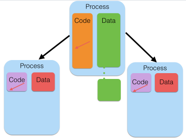

</div>

## Rdsm

Rdsm allows you to share a matrix across processes on a node - for reading *and* for
writing.

Normally, when we split a data structure up across tasks, we make copies (PSOCK), or
we use read-only (multicore/fork).

If output is also going to be large, we now have 2-3 copies of the data structure floating
around.

Rdsm allows (on-node) cluster tasks to collaboratively make a large output without copies.


## Rdsm

Simple example - let's create a shared matrix, and have everyone fill it.

Create PSOCK cluster, an Rdsm instance, shared matrix, and a barrier:


```r
library(parallel)
library(Rdsm)

nrows <- 7

cl <- makePSOCKcluster(3)       # form 3-process PSOCK (share-nothing) cluster
init <- mgrinit(cl)             # initialize Rdsm
mgrmakevar(cl,"m",nrows,nrows)  # make a 7x7 shared matrix
bar <- makebarr(cl)
```

## Rdsm

Everyone gets their task id, and which rows are "theirs";


```r
# at each thread, set id to Rdsm built-in ID variable for that thread
clusterEvalQ(cl,myid <- myinfo$id)
```

```
## [[1]]
## [1] 1
## 
## [[2]]
## [1] 2
## 
## [[3]]
## [1] 3
```

```r
clusterExport(cl,c("nrows"))
dmy <- clusterEvalQ(cl,myidxs <- getidxs(nrows))
dmy <- clusterEvalQ(cl, m[myidxs,1:nrows] <- myid)
dmy <- clusterEvalQ(cl,"barr()")
```
...then fills it with their id.

## Rdsm
Now, print the results.

```r
print(m[,])
```

```
##      [,1] [,2] [,3] [,4] [,5] [,6] [,7]
## [1,]    1    1    1    1    1    1    1
## [2,]    1    1    1    1    1    1    1
## [3,]    2    2    2    2    2    2    2
## [4,]    2    2    2    2    2    2    2
## [5,]    2    2    2    2    2    2    2
## [6,]    3    3    3    3    3    3    3
## [7,]    3    3    3    3    3    3    3
```

```r
stoprdsm(cl)  # stops cluster
```

## Summary: Rdsm

Allows collaborative use of a single pool of memory.

Avoids performance and memory problems of making copies to send back and forth.

Works well when:

- Outputs are as large/larger than inputs.  (Correlation matrix of stocks).
- Inputs are very large, and want to do transformation in-place (values to log-returns).

## pbdR

<div class="columns-2">
The master-worker approach that all the methods we've used so far take works very well for interactive work,
is easy to loadbalance, and is easy to understand.

But there's a fairly narrow range of number of workers where master-worker works well.  

For a small number of total processors (2-4, say), it really hurts to have one processor
doing nothing except some small amount of coordination.

For a very large number of processors (hundreds or more, depending on the size of each
task), the workerscan easily overwhelm the master, meaning all of the workers are 
sitting around waiting while the master  catches up.

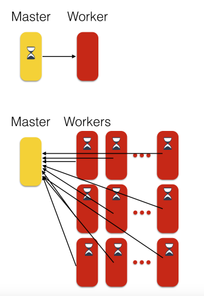

</div>

## pbdR

At scale, idea of a single master isn't helpful.

Better: Coordinating peers. 

Rather than a single master parcelling out work, the workers themselves decide which part of the problem
they should be working on, and combine their results cooperatively.

More efficient and can scale better; Downsides:

- Dynamic load-balancing is substantially trickier (but doable)
- Can't really do this interactively; need to write a script

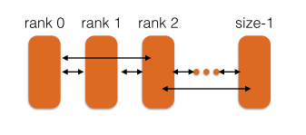

## Departure Hour Histogram Example

In `pbd/mpi-histogram.R` we have a script that does hour histogram for eight full years of data, sifting through
40 million flights, in about a minute:
```
$ time mpirun -np 8 Rscript mpi-histogram.R
COMM.RANK = 0
 [1]    4081  118767   27633    7194    9141  194613 2235007 2902703 3003510
[10] 2649823 2373934 2473105 2757256 2772498 2362334 2485699 2503423 2794298
[19] 2626931 2282125 2074739 1386485  649392  344257
COMM.RANK = 0
[1] 41038948

real  1m15.357s
user	9m39.943s
sys	0m10.910s
```

## Departure Hour Histogram Example

What sorcery is this?


```r
# count.hours and get.hour definitions...
start.year <- 1990

init()
rank <- comm.rank()
my.year <- start.year + rank

myfile <- paste0("data/airline/airOT",as.character(my.year),".RDS")
data <- readRDS(myfile); data <- data$DEP_TIME
myhrs <- count.hours(data)

hrs <- allreduce( myhrs, op="sum" )
comm.print( hrs )
comm.print( sum(hrs) )

finalize()
```

## Departure Hour Histogram Example

Let's take a look at the first few lines

```r
# count.hours and get.hour definitions...
start.year <- 1990

init()
rank <- comm.rank()
my.year <- start.year + rank

myfile <- paste0("data/airline/airOT",as.character(my.year),".RDS")
data <- readRDS(myfile); data <- data$DEP_TIME
```
In this case, each task decides which year's data to work on.  First ("zero^th^") task works on 1990, next on
1991, etc.

Every task has to call the `init()` routine when starting, and `finalize()` routine when done.

Then reads in the file.

## Departure Hour Histogram Example


```r
data <- readRDS(myfile); data <- data$DEP_TIME
myhrs <- count.hours(data)

hrs <- allreduce( myhrs, op="sum" )
comm.print( hrs )
comm.print( sum(hrs) )

finalize()
```
Once the file is read, we use our trusty count.hours routine again to work on the entire vector.  

Then an `allreduce` function sums each workers hours, and returns the sum to all processors.  We then
print it out.

Rather than only the master running the main program and handing off bits to workers, every task runs 
this identical program; the only difference is the value of `comm.rank()`.

## Reductions

Reductions are one way of combining results, and they're very powerful:


```r
init()
rank <- comm.rank()
my.year <- start.year + rank

myfile <- paste0("../data/airline/airOT",as.character(my.year),".RDS")
data <- readRDS(myfile); data <- data$CRS_ELAPSED_TIME
data <- data[!is.na(data)]

data.median <- pbd.quantile(data,0.5)
data.min <- allreduce(min(data), op="min")
data.max <- allreduce(max(data), op="max")
data.N <- allreduce(length(data), op="sum")
data.mean <- allreduce(sum(data), op="sum")/data.N

comm.print(data.min)
comm.print(data.median)
comm.print(data.mean)
comm.print(data.max)

finalize()
```

## Reductions

```
$ mpirun -np 4 Rscript ./min-median-mean-max.R
COMM.RANK = 0
[1] -70
COMM.RANK = 0
[1] 93.00004
COMM.RANK = 0
[1] 112.8207
COMM.RANK = 0
[1] 1613
```

## Median finding:

R's higher-level functions plus reductions are very powerful ways to do otherwise
tricky distributed problems - like median of distributed data:

```r
pbd.quantile <- function( data, q=0.5 ) {
    if (q < 0 | q > 1) {
        stop("q should be between 0 and 1.")
    }

    N <- allreduce(length(data), op="sum")
    data.max <- allreduce(max(data), op="max")
    data.min <- allreduce(min(data), op="min")

    f.quantile <- function(x, prob=0.5) {
        allreduce(sum(data <= x), op="sum" )/N - prob
    }

    uniroot(f.quantile, c(data.min, data.max), prob=q)$root
}
```


## pbd*apply

`pbd` also has its parallel apply functions, but it's important to realize that these aren't being
farmed out by some master task; the tasks themselves decide which ones in the list are "theirs".

`pbd/histogram-pbdsapply.R`

```r
year.hours <- function(my.year) {
    myfile <- paste0("data/airline/airOT",as.character(my.year),".RDS")
    data <- readRDS(myfile)$DEP_TIME
    count.hours(data)
}

init()
years <- 1990:1993
all.hours.list <- pbdLapply(years, year.hours)
all.hours <- Reduce("+", all.hours.list)

comm.print( all.hours )
comm.print( sum(all.hours) )

finalize()
```

## pbd Data Distributions

<div class="columns-2">
pbd has a couple of ways of distributing data.  

What we've used before is their so-called "GBD" distribution - globaly distributed data.
It's split up by rows.

However, for linear algebra computations, a block-cyclic distribution is much more
useful.


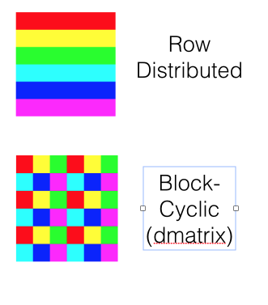

</div>

## Reading a pbdR Ddmatrix

pbdR comes with several packages for reading a data file and distributing it as a
ddmatrix:

- `read.csv.ddmatrix()` for reading from csv
- `nc_get_dmat()` to read from a NetCDF4 file
- `gbd2dmat()` for conversions from row-oriented to a ddmatrix.


## pbd lm

And the reason that you'd use a ddmatrix is that several operations defined
on regular R matrices also work transparently on ddmatrix: `lm`, `solve`, `chol`.

`pbd-lm.R`:

```r
init.grid()
rank <- comm.rank()
my.year <- start.year + rank

data <- cleandata(my.year)
Y <- data[[1]]
X <- as.matrix(data[,-1])

X.dm <- gbd2dmat(X)
Y.dm <- gbd2dmat(Y)

fit <- lm(Y ~ X)
comm.print(summary(fit))

finalize()
```

## pbd lm
```
$ mpirun -np 4 Rscript pbd-lm.R
Using 2x2 for the default grid size

COMM.RANK = 0

Call:
lm(formula = Y ~ X)

Residuals:
     Min       1Q   Median       3Q      Max
-1307.62    -6.03    -2.29     3.53  1431.70

Coefficients: (6 not defined because of singularities)
                       Estimate Std. Error t value Pr(>|t|)
(Intercept)           1.152e+01  9.616e-02  119.77   <2e-16 ***
XORIGIN_AIRPORT_ID   -1.895e-04  5.193e-06  -36.50   <2e-16 ***
XDEST_AIRPORT_ID     -2.257e-04  5.213e-06  -43.29   <2e-16 ***
XDEP_TIME            -3.382e-04  1.724e-05  -19.61   <2e-16 ***
XDEP_DELAY_NEW        1.426e+00  9.594e-03  148.68   <2e-16 ***
...
---
Signif. codes:  0 '***' 0.001 '**' 0.01 '*' 0.05 '.' 0.1 ' ' 1

Residual standard error: 13.43 on 2741063 degrees of freedom
Multiple R-squared:  0.7809,  Adjusted R-squared:  0.7809
F-statistic: 1.628e+06 on 6 and 2741063 DF,  p-value: < 2.2e-16
```
